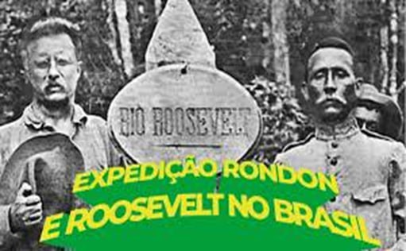

### A LENDA DOS PAITITIS: OURO, DIAMANTES E O PÁSSARO DE FOGO

Diz a lenda que quando Pizarro saqueou os Incas, parte do povo fugiu para a selva levando um tesouro colossal. Onde o esconderam? Entre Vila Bela da Santíssima Trindade e Guajará-Mirim, na margem direita do Rio Guaporé. Seria o lendário Paititi, o Eldorado que bolivianos, peruanos e colombianos seguem buscando.

Em 2001, o arqueólogo Mario Polia, pesquisando os arquivos do Vaticano, encontrou um manuscrito de um jesuíta espanhol dos meados do século XVI, Andres Lopes. Nesta carta, relata uma viagem com uma duração de muitos dias pela selva a partir de Cusco, em busca de um reino ou uma cidade onde havia mais ouro do que em Cusco. Seria esta cidade "Paititi"?

*Marechal Cândido Rondon e Theodore Roosevelt na expedição pelo Rio da Dúvida (Rio Roosevelt).*

### DE ROOSEVELT À RESERVA

Certo é que "Cabeza de Vaca" jamais ouviu falar desse tesouro e a lenda possivelmente motivou o Marechal Rondon a fazer um ângulo de noventa graus no traçado da linha telegráfica quando chegou na região de Vilhena. Mais tarde, juntamente com Theodore Roosevelt, empreenderam uma expedição pelo Rio da Dúvida, hoje Rio Roosevelt. Nada encontraram além do próprio rio. 

Diria, nada encontraram porque não procuraram direito. Isso porque no fim do século XX, oitenta anos após a lendária expedição, foi descoberta uma grande mina de diamante, uma das maiores do mundo, justamente na reserva Roosevelt. Não por acaso, está encravada na reserva indígena dos Cinta Larga. Desde então, muitas ocorrências de contrabando, corrupção e assassinatos. Para todos os efeitos, não pode ser explorada. A reserva Roosevelt, de onde os diamantes eram extraídos pelos criminosos, tem uma área de 231 mil hectares e fica localizada entre a divisa de Rondônia e Mato Grosso. Na área existem dois povos indígenas, entre eles o Cinta Larga.

### A MULHER NUA E O URUCUMACUÃ

A lenda das minas de Urucumacuã diz que, para alcançar o tesouro, o viajante cruza o cerrado e avista uma mulher nua e linda que indica o caminho. Mas logo surge o pássaro de fogo Urucumacuã e põe tudo em fuga. Tamanho tesouro não seria entregue ao primeiro forasteiro. É preciso coragem, sorte e um pau-de-fogo na cinta para enfrentar o guardião amazônico.

Supõe-se também que a expedição Roosevelt tenha encontrado vestígios da mina, todavia, entretanto, corria o ano de 1915, não demorou e sobreveio a primeira grande guerra, e tudo ficou no mais profundo silêncio. De outro lado, Rondon, que era mais "caxia" que o próprio Caxias, se falou alguma coisa sobre os diamantes, não falou para nenhum aventureiro. Fato é que logo após sua morte em 1956, a região passou a ser visitada e explorada por aventureiros e garimpos ilegais. Mas aí a novela é outra. O presidente Juscelino determinara a abertura da BR 364. Rodovia essa, sem a qual nada seria factual.

Enfim, Paititi, Eldorado, Urucumacuã, Fawcett, Serra do Roncador, Reserva Roosevelt, Rio da Dúvida — é tudo um mistério. Mas diamantes e ouro por lá tem, e muito.
