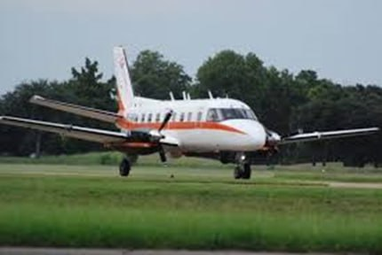
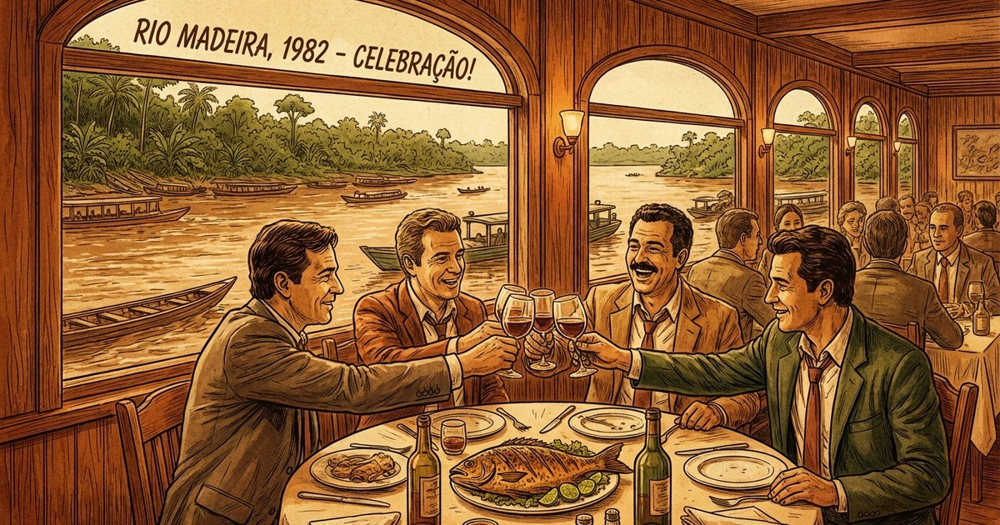

Era o ano de 1982 e as eleições aconteceram em 15 de novembro. Até aqui nem uma novidade — eleições gerais, menos para Presidente da República e governadores, isso por conta da revolução de 1964. Eu ainda era guri, mas lembro quando o diretor do internato, empunhando um jornal, disse: — Esse General merece uma estátua em praça pública. Chamava-se Amaury Kruel. Na verdade, ele retirou o apoio que dava sustentação ao então presidente João Goulart e assim não houve enfrentamento entre tropas do exército brasileiro. A partir de 31 de março daquele ano o país teve outros rumos.

A história aqui é outra. Um acontecido vinte e dois anos mais tarde, ou seja, logo após 15 de novembro de 1982. Foi por ocasião da primeira eleição da OAB/RO. Entre os decanos inscritos figuravam Odacir Soares, Rubens Moreira Mendes e Miguel Roumie, e outros.

Odacir fora eleito senador e procurou direcionar a eleição da OAB, apadrinhando Moreira Mendes. Na disputa entrou também Miguel Roumie, como e porque não sei. Acontece que o grande eleitorado estava concentrado em Porto Velho, vez que o interior contava com poucos causídicos — a grande maioria procedentes do Sul, em busca de novos horizontes e com poucos contatos na capital.

Moreira Mendes cumpriu com o seu papel de candidato visitando pessoalmente os colegas das cidades interioranas. Tanto é que, em um dia empoeirado, apareceu em Rolim de Moura em meu escritório um senhor engravatado, com os sovacos molhados de suor, pedindo-me o apoio para sua eleição. Na sede do município Cacoal, já labutavam creio que outros oito causídicos: Rufino, Roberto Naufel, Theotônio, José Albuquerque, Líbio Medeiros e Vornei Bernardes. Rufino e Francisco resolveram não participar da eleição.

Odacir, todo poderoso, para garantir a vitória do seu candidato usou das benesses do cargo de senador ainda não empossado e prometeu um avião ida e volta até Cacoal, para transportar o eleitorado da longínqua comuna. Os causídicos da "Zona da Mata" — assim definida a região pelos portovelhenses, pretensos cosmopolitas.

De acordo com o combinado, todos votariam em Moreira Mendes, até mesmo porque não se tinha notícia de outro candidato. Dia e hora marcados, aterrizou o "asa dura".

Com mais horas de voo sobre a Amazônia que urubu cabeça-preta. Na fila de embarque, Líbio tomou a dianteira e, por auto-indicação, assumiu o posto de "copiloto". Comentou-se depois que o ponto mais alto até então atingido por Líbio fora a Serra da Canastra, na busca de um queijo.

Naufel e José Albuquerque, vindos do Paraná, já eram mais mateiros — um tinha trabalhado na Caixa Econômica e o outro até fora vereador de uma cidade de dois mil eleitores. Theotônio, ferramenteiro da Petrobrás, fora expulso por participar de movimentos sindicais contra a ditadura. O dito conseguia polemizar o que fosse. Eu ali no meio, por sinal mais pra beira, no final do charuto. E Vornei, com jeitão de matuto, um tanto cabreiro, viera do interior de São Paulo — creio que de Araçatuba —, filho de boiadeiro que repontava tropas de Mato Grosso para Rondônia. Gente fina. Soubemos depois que ele sofria de aerofobia, ou "medo de avião".

## O Tambaqui da Traição

A viagem foi ótima, todos muito contentes e satisfeitos. Afinal, ir de Cacoal até Porto Velho por via terrestre, naquele momento, seria algo sacrificoso. Era o nosso primeiro voto na OAB. Iríamos eleger o primeiro presidente da Seccional. Tudo na mais estrita legalidade. Só alegria. Hotel Guaporé e um dia de folga. A eleição seria no outro dia, na parte da tarde.

Foi quando correu a notícia que haveria um almoço de confraternização no Mirante do Madeira — o Point. Lá fomos nós, atendendo ao honroso convite. Após servido o famoso tambaqui e alguns brindes, percebemos a ausência do candidato. Compromissos outros, talvez. Afinal, o Estado estava em polvorosa com a recente eleição de vereadores, prefeitos, deputados estaduais, federais e senadores. Era autoridades por todo lado, excelências tropeçando em excelência.

Alguém pediu um momento de atenção e, sem delongas, concedeu a palavra ao advogado interiorano Orestes Muniz — já nosso conhecido da cidade de Ji-Paraná, sede da comarca que abrangia várias outras cidades. Após os costumeiros cumprimentos, mencionando nomes anotados aleatoriamente num guardanapo de papel, lamentou a ausência do colega Moreira Mendes e disse de suas virtudes. Porém, no seu entender, naquele momento, lhe parecia que a entidade ficaria melhor representada na pessoa do também amigo e colega Dr. Miguel Roumie.

— Os advogados devem ser paladinos das liberdades democráticas massacradas pela Ditadura, porquanto devem atuar com independência e sem comprometimento político-partidário.

Roumie residia no Território do Guaporé há muitos anos. Com muito sacrifício cursou Direito em Manaus e, depois, qual sacerdote, exerceu a árdua advocacia ao longo da ferrovia Madeira-Mamoré — Porto Velho a Guajará-Mirim —, quando não viajando apinhado nas históricas gaiolas pelas barrentas e traiçoeiras águas do Rio Madeira até Humaitá, cidade do Amazonas, duzentos quilômetros de Porto Velho.

— Desta feita, tudo o que ele podia fazer era dar apoio ao nobre e brilhante colega em seu pleito para presidente da seccional, e assim bem nos representar perante o Conselho Federal.

Vivas e aplausos. Mais alguns copos e fomos todos para o escrutínio secreto. **Venceu Miguel Roumie de lavada.**

## O Trem Não Baixou

No outro dia, bem cedo, todos no aeroporto. A nave nos esperava. Acomodados como dantes — Vornei no fundo do charuto.

Quando já no solavanco entre as nuvens, Theotônio, paraibano da caatinga, falando mais que o homem da cobra, não se conteve: — Meti o fumo no rabo do candidato dos milicos!

O voo seguia o traçado da BR-364. Líbio, ao lado do piloto, passou a mão no bigode e, mineiramente, falou: — O meu candidato venceu...

Ao que Albuquerque emendou: — O seu não, o nosso.

Vornei, encolhidinho lá no fundo, tenso feito bode embarcado, com voz cavernosa completou: — Foi uma lavada. Agora, falta só chegarmos em casa são e salvos.

Lá embaixo o panorama era o verde da mata, por vezes rasgada por trilhas abertas pelos madeireiros e migrantes que chegavam aos milhares vindos de todas as partes do Brasil. Passamos Ariquemes, Jaru, Ouro Preto, Ji-Paraná, Presidente Médici — sempre tendo por referência a BR-364, ponteada por caminhões que vagarosamente transitavam levantando nuvens de poeira.

Não tardou e o piloto anunciou: — Cacoal. Vamos aterrissar.

Já na cabeceira da pista, arremeteu. Naufel entrou em pânico de riso. Sem saber porque do riso e o que estava acontecendo, ouvi Líbio murmurar: — O trem não baixou.

— Eita Lasquera!

— Só podia ser um avião desse exército genocida!, exclamou Theotônio.

O ambiente ficou tenso, porém foi tudo muito rápido. Ao sobrevoar o Rio Machado, cheguei até pensar que poderia ser uma alternativa — porém a nave foi reconduzida e então escutei um barulho:

**TRUM... Drum, drum, drum...**

Pousou tranquilamente. Que alívio. Vencemos mais uma.

---

**P.S.**

1. Miguel Roumie renunciou à presidência da Seccional quando teve seu nome aprovado pela Assembleia Legislativa para o cargo de Conselheiro do Tribunal de Contas.
2. Orestes Muniz, mais tarde, foi Deputado Federal, Vice-Governador e Presidente da OAB/RO.
3. Rubens Moreira Mendes foi Deputado Federal e Senador.

Por fim, todos foram felizes para sempre.
