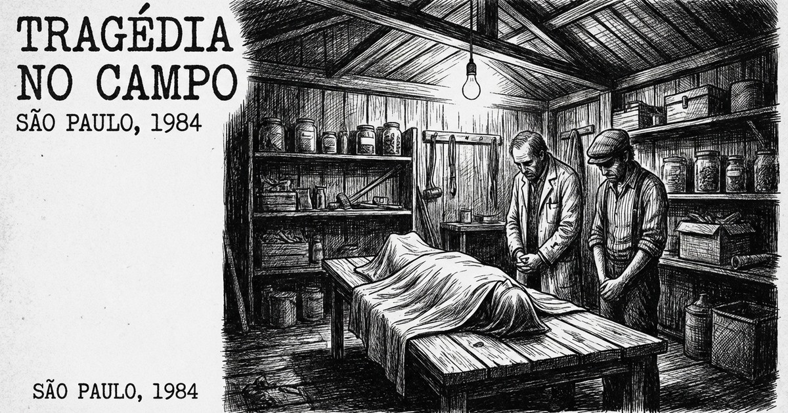

Já fazia dois anos que eu estava na cidade, bem adaptado com aquele ambiente rústico e insalubre. Várias amizades e entrosamento com pessoas da indústria e do comércio. Quase que diariamente surgiam informações desencontradas de mortes por acidente de trabalho e vítimas da malária e outras doenças tropicais.

Aconteceu que um senhor de muitas posses de Curitiba resolveu fazer um empreendimento na Amazônia, na exploração de madeiras. Adquiriu bons equipamentos — serras, caminhões, tratores — e se instalou em Vilhena. Para tocar o empreendimento, contratou um parente distante da família que residia em Jaraguá do Sul, onde era professor.

Lamentavelmente, e por desconhecimento, escolheu um lugar onde o ciclo da madeira já se esgotara, principalmente porque o mercado só se interessava por madeiras nobres — como cerejeira, mogno e algumas outras variedades. O empreendimento nasceu morto.

Tentando contornar a situação, determinou que o gerente mudasse para Rolim de Moura, onde a madeira era farta. Farta era — centenas de serrarias competiam acirradamente. Não sobrou outra alternativa senão a de prestação de serviços, transportando madeira para as serrarias. Em que pese ter estrutura, era uma atividade de sobrevivência.

## A Tora

Nessa jornada, um determinado dia foi trágico. Ao descarregar o caminhão, soltos os cabos de aço, a carga caiu de uma vez — e uma tora ricocheteou e atingiu o sujeito que ali mesmo ficou inerte.

Comunicado o patrão, este de pronto me procurou por telefone pedindo auxílio e deu as ordens:

— Quero transportar o falecido para Jaraguá do Sul, onde estão seus parentes. Resolva isto para mim.

De pronto saí para a missão. O corpo já estava na funerária, sem um cristão para acender uma vela. Me apresentei, dizendo que o corpo seria transladado para Curitiba.

— Pois sim, senhor — disse o agente funerário. — Temos caixão apropriado, mas não temos profissional para o embalsamamento.

Eis o nó górdio. Um médico seria a solução. Procurado o profissional, disse-me:

— Faço o serviço, porém preciso de um ajudante e não tenho.

Sobrou para o causídico.

— O que devo fazer?

— Simples. É só me acompanhar na atividade.

## O Barracão

Transportado o corpo para o hospital, o médico disse:

— Depositem-no sobre a mesa que está lá no barracão.

Um espaço que se destinava a guardar ferramentas e outras coisas sem uso.

Logo chegou o médico com bisturi e outros aparelhos. Examinou superficialmente e traçou o corte.

— As vísceras vão cair e você acondicione nesse saco plástico e põe no caixote.

Até que não foi difícil.

— Agora vamos higienizar, com água e sabão.

Uma mangueira de água e sabão líquido. Feito isso:

— Vamos injetar formol em quantidade.

E com uma seringa gigante injetou formol do dedão do pé até o couro cabeludo, além de lavar todo o corpo internamente.

E lá vai o causídico com as mãos nas cavidades de peito e vísceras.

Preenchimento com algodão, conforme o manual. A questão foi que faltou material — e assim foi complementado o enchimento com folhas de jornal. Lembro bem de uma das manchetes da época:

**"Presidente Figueiredo acena com a Abertura e a Anistia."**

Pensei comigo: esse não será beneficiado.

## A Brilhantina

Encerrada a atividade, o corpo foi costurado e, seguindo o manual, deveria ser untado com óleos especiais com propriedades antimicrobianas, antifúngicas, antioxidantes e desodorizantes — substâncias que ajudam a retardar a decomposição, sendo a mirra um dos mais tradicionais.

Só que não tínhamos.

Lembrei o meu professor de medicina legal, o Dr. Romanó: *"Use a criatividade. O sujeito já está morto."*

Foi o que sugeri:

— E se untarmos com brilhantina?

— Boa ideia! — disse o médico.

E partiu para a feirinha em busca da brilhantina. Lá veio ele com um frasco de 500 ml. Mãos lambuzadas e corpo untado.

A encomenda foi para o carro funerário e partiu para Cuiabá — e dali pra frente seria via aérea. O corpo chegou ao seu destino. Honorários na conta e mil agradecimentos pelos serviços prestados.
