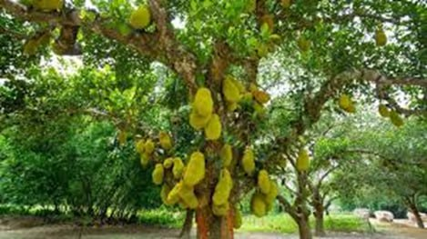

Pelas lides forenses, em Rondônia encontrei um advogado que viera do Rio Grande do Sul. Estendendo a conversa, disse-me ele:

— Cheguei em Rondônia em 1978. Recém formado na faculdade de Passo Fundo, bolei a perna, e sentei os garrões no Território. Viagem cansativa. Já era escuro quando bati o pé na soleira da casa de uma tia que viera tempos antes.

Para não dizer que tudo era na base da luz de vela, a casa era guarnecida por um motor estacionário, o qual gerava energia até a hora de dormir. Umas prosas e todo o mundo pra cama.

— Acordei com o barulho de panelas. Titia já estava preparando um café reforçado.

Olhei para a porta dos fundos, e fiquei impressionado com uma árvore que havia no quintal. De pronto quis saber que espécie era aquela. Seria uma árvore típica?

A resposta foi quase que lacônica:

— Isso aí é um político.

Intrigado, busquei esclarecimentos — afinal eu já era advogado, e meias respostas já não me eram suficientes.

## A Comparação

— Na verdade, é uma jaqueira, mas eu chamo isso de político.

— Como assim, não estou entendendo.

— Mera comparação, mas eu explico. Veja bem: é uma árvore bastante frondosa, produz uma boa sombra, tem um belo fruto — além de outros atributos, como casca grossa e bagos melequentos.

— Sim, e daí? Como se diz no Rio Grande: o que tem a ver um causo com outro?

— Como disse, mera comparação. O político é meio parecido com um pé de jaca. Ele sempre se mostra vistoso, importante e bonachão.

— Verdade, o político tem que mostrar suas qualidades, mas o que tem a ver com esta árvore que não existe no Rio Grande?

— De fato por lá não tem, mas tem alguma coisa meio parecida.

— O que tem de parecido por lá?

— O pinheiro. Alto, bonito, casca grossa, uma fruta lá pela ponta dos galhos — que se cutucada com uma taquara se debulha e se esparrama pelo chão, e dá um trabalho danado para juntar os pinhões no meio das grimpas e samambaias, e a gente sai todo arranhado.

— Verdade. Até aí tudo bem, mas não vejo que seja igual essa dita jaqueira.

— Não é igual, mas é tudo meio parecido. Estás vendo a fruta? Até se parece com uma pinha. Tudo cheio de "não me toque", e bem grudada no pau. Agora, experimente pegar uma. Se tá verde, larga um leite pegajoso. Se está madura, vira uma meleca de cheiro duvidoso. Mas é fruta e você tenta aproveitar. Tem que rasgar a casca, e você fica todo lambuzado. Mesmo assim a gente experimenta. Depois de umas duas bagas, dá enjoo — e tem que tirar do quintal porque atrai muita mosca. E se jogar para os porcos, eles recusam.

— Tudo bem parecido com um político.

## Debaixo não Cresce Nada

— Mas báh tchê! E eu que vim para esse Território pensando em resolver minha vida, ser útil para a sociedade, me candidatar a vereador, prefeito, deputado — e quem sabe até mais que isso. Assim, tia, você me desanima logo na chegada.

— Não meu sobrinho, vai com calma. É cedo, vamos tomar um chimarrão e prosear. Pra tudo se dá um jeito. É de vagar se tropeia.

— Ainda bem, porque já estava pensando em voltar para o Rio Grande.

— Por aqui tem muitas vantagens. As coisas acontecem rápido. Por exemplo: se você plantar um pé de jaca, com três anos já vai estar produzindo.

— Mas onde vou plantar um pé de jaca se não tenho um palmo de chão?

— Em qualquer lugar. Pode até ser na beira da estrada. Mas muito cuidado.

— Cuidado com quê?

— Que debaixo de um pé de jaca não cresce nada. Nem capim.

— Sei. Estou entendendo.

O sol já estava alto e eu por ali, sapateando, indeciso e ao mesmo tempo curioso. Foi quando minha tia me falou:

— Por aqui ninguém fica sem um pé de jaca. Então, vai lá — fala com o prefeito. Ele é gente boa.

Me bandei. Mal mostrei minhas credenciais e ele me disse:

— É de gente assim que estamos precisando. *"Vamo"* ali na sombra da jaqueira para a gente conversar melhor.
