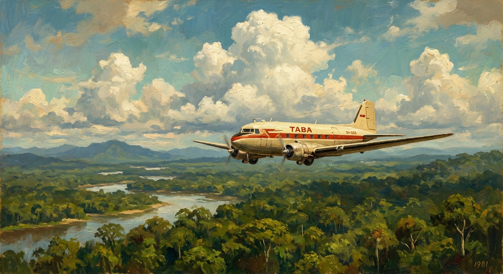
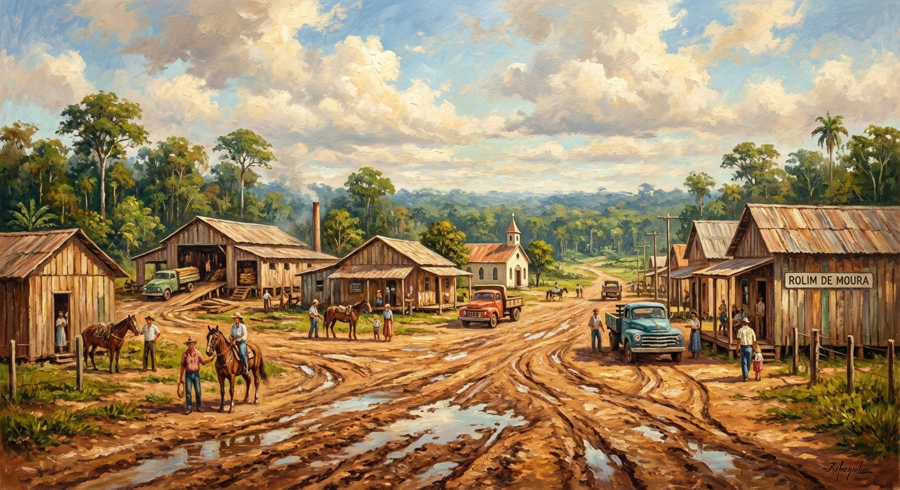

Ao contrário de “Cabeza de Vaca”, fui do Sul pro Norte. Com 31 anos era hora de buscar outro rumo. Por uma referência aleatória me bandei para Rondônia. A Amazônia estava sendo ocupada, no cumprimento do objetivo do governo: “Integrar para não a Entregar”. 

O destino era Cacoal, cidade que surgiu na margem da BR 364, na década de 70. Até então Rondônia era uma densa floresta cortada por uma estrada aberta por Juscelino Kubitschek, mais precisamente de Cuiabá a Porto Velho. O traçado já fora feito pelo Marechal Cândido Rondon em 1910, quando construiu a linha telegráfica Cuiabá-Porto Velho. 

### A Grande Travessia

Em março de 1981 parti de Curitiba com uma mala e uns pacotes. De um só lance a Viação Andorinha, partindo de Maringá, atravessou o cerrado matogrossense. Uma viagem um tanto monótona. Por vezes a paisagem era quebrada pela presença de seriemas, casebres, barracas de lona e tratores que já começavam a rasgar o cerrado. Foram 24 horas de viagem até Cuiabá. Era praticamente o início da viagem; seriam mais mil quilômetros por uma estrada inimaginavelmente precária. 

Em 1972 o Governo Federal criou o projeto de colonização do Território Federal de Rondônia. Migrantes de todas as partes do Brasil passaram a ocupar a banda oriental da Amazônia. O POLONOROESTE tinha como principal finalidade o atendimento à região do entorno da rodovia Cuiabá-Porto Velho (BR 364). 

O primeiro choque de realidade aconteceu ao descer do ônibus em Cuiabá. Na rodoviária uma tabuleta informava o local de vendas de passagens para Cacoal. Aproximei-me do guichê para comprar a passagem. De pronto o atendente informou que era necessário aguardar o retorno do ônibus que estava com um atraso de 15 dias. 

Foi uma ducha de água fria despejada em meu corpo suado, cansado e empoeirado. Era uma outra realidade. Tinha ônibus, mas, ao mesmo tempo não tinha. Foi bom, dado que do contrário teria sucumbido no deserto verde e lamacento. Permaneci em Cuiabá por uma semana na casa de um amigo, que se formara em medicina veterinária e havia migrado para Cuiabá. 

Após conhecer algumas particularidades da região, consegui uma vaga no voo semanal da TABA (Transportes Aéreos da Bacia Amazônica). Uma aeronave do tempo da guerra. Talvez tivesse cumprido algumas missões jogando bombas sobre redutos nazistas ou transportando o brigadeiro Eduardo Gomes. Bimotor, dezesseis lugares. Todos os passageiros acomodados em assentos espremidos por malas, caixotes e bugigangas. Até uma gaiola com um filhote de cão de caça. 

O avião partiu às 14:30 horas. O tempo estava bom. Da janelinha dava para contemplar o infinito da floresta e por vezes sumíamos entre as nuvens encasteladas. Por volta das cinco da tarde a nave aterrissou na cidade de Pimenta Bueno. A pista era um lamaçal ladeado pela floresta. Restavam 50 quilômetros para o destino final. Ali mesmo na pista apareceram táxis. Lotamos um fusca e partimos. 

O taxista alertou que havia atoleiros e teríamos que passar por dentro da aldeia indígena e era necessário pedir autorização do cacique. Já era noite, o motorista desceu e foi um momento de tensão. Retornou com permissão para passar. Nunca soube se o cacique estava de boa ou era só pró-forma. 

Não demorou e chegamos ao destino sob uma forte chuva. O táxi parou na porta do único hotel da cidade: “Hotel Decolares”. Janta, pernoite e café da manhã. Dia 22 de março de 1981. O bom da história é que o dinheiro acabou. Não furei o teto orçamentário, contudo, foi necessário cortar algumas despesas.

### O Nascimento de um Estado

Clareou o dia e fui em busca da única referência que tinha daquele lugar. Um paranaense nascido em Santa Catarina que havia migrado para Rondônia há alguns anos e dono de serraria. Não foi difícil encontrá-lo. Apresentou-me a um advogado paraibano. Fato foi que às oito horas da manhã eu estava acomodado em seu escritório. Só faltava dinheiro para comer e lugar para dormir. 

Postado na porta do escritório, veio-me na lembrança a história de “Cabeça de Vaca”. Ele sentado na pedra bruta, atordoado com o barulho das águas do Rio Iguaçu, ouviu o conselho do cacique carijó: Tererê. Fica frio. A questão agora era não querer ser chefe da corrutela. Ali a regra era cada qual por si e Deus por todos. Cada qual carregando o seu “cacaio” e pé na estrada. 

União para abrir uma picada, derrubar a mata, construir barracos e pinguelas e velar os mortos. Tudo era compartilhado, inclusive o barraco de lona. Vilas e cidades surgindo na floresta. A corrida pela madeira, pela terra e o sonho da riqueza. Ali era o novo Eldorado. Capixabas, paranaenses, nordestinos e gaúchos, todos plantando o que conheciam. Carne de paca, de mateiro e tatu. Malária e Leishmaniose. Escolas pau-a-pique, transportes pau-de-arara. Enfim, foi um ano de conhecimento e resiliência. 

Quatro de janeiro de 1982, o Território é transformado no mais novo Estado brasileiro. Em fevereiro me instalei em uma vila: Rolim de Moura. E por ali fiquei. Nome em homenagem a D. Antônio Tavares de Rolim de Moura, conde de Azambuja, que em 1752 fundou a cidade de Vila Bela da Santíssima Trindade. 

Quarenta anos se passaram. A população cresceu, as cidades se transformaram. Outras surgiram. A produção agropecuária evoluiu. Há que se lamentar os bolsões de pobreza, a falta de perspectiva de milhares desta nova geração e a desigualdade social gritante. Assim caminha a humanidade. Nos orgulhamos de Rondônia por ser um estado jovem e por ter o melhor índice de transparência de todo o Brasil. 

Restam os versos do poeta: “Tudo vale a pena quando a alma não é pequena” (Fernando Pessoa). O que mudou?
