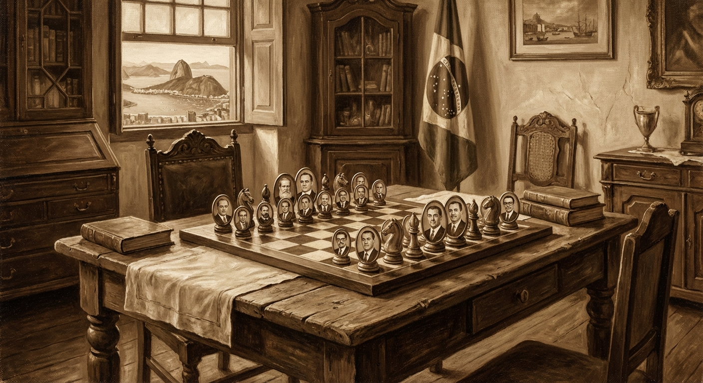

## Saudosa Maloca

Em novembro de 2017 viajamos. Curitiba e sudoeste do Paraná. Ver parentes é muito bom. Já havíamos ido outras vezes, mas desta vez era um evento especial: o **2º Encontro da Família Baldo**. Gente com parentesco distante estavam lá. Até o Padre era da família. Paraná, Santa Catarina, Rio Grande do Sul, Rondônia, Maranhão. Mais de 300. 

A origem: imigrantes italianos do final do século dezenove. Todos vindo do norte da Itália — Bassano del Grappa, Marostica e Vicenza. Para o encontro somente compareceram os mais folgados. Era o mês de novembro e muitos não puderam comparecer por conta de suas atividades. O encontro foi promovido pelos tataranetos dos imigrantes Luigi e Domenico; bisnetos de Antônio, e netos de Ângelo Baldo, Nilson e Ivoni, e o neto de José Baldo, Valdorino Baldo. Outros encontros foram promovidos em 2018 na cidade de Descanso, Santa Catarina. Outro encontro estava agendado para a cidade de Pato Branco, que não ocorreu em razão da pandemia. 

Por outro lado, em 2018 o cenário político estava complicado. A derrubada de Dilma e os esquemas de corrupção incomodavam. Lula estava preso. Política era uma palavra proibida. Afinal não se pode falar de corda em casa de enforcado. Nós cidadãos comuns estamos acima de qualquer suspeita, portanto, segue o baile. O lado bom é que o Corinthians foi campeão. Em seguida veio Papai Noel e de "saco cheio".

## Retratos da República

Pois, pois. E como foi 19, 20, 21 e 22? Diria nem te conto, mas um mínimo deve ser lembrado.

O ex-presidente que estava preso foi solto. Tudo foi bem arquitetado. Em 15 de abril de 2021 o STF aplicou o jeitinho brasileiro e anulou o processo. E não houvera de ver que lhe foi permitido disputar a presidência da República. Foi de tirar o pica-pau do oco. 

Em 2018, coisa que ninguém imaginava, um deputado federal já cansado de gritar sozinho no parlamento se candidatou e foi eleito presidente. Apesar de ter levado uma facada que o colocou no bico do urubu. Venceu e tomou posse em janeiro de 2019. Gerou grandes expectativas e inconformismos. 

De acordo com os especialistas midiáticos o Brasil ficou politicamente polarizado. Grandes novidades, diria alguém com desdém. Isso já aconteceu em 1929, 1934, 1954, 1964, 1984. A panela sempre esteve fervendo; o problema é que quem está de fora só percebe quando alguém levanta a tampa ou o caldo entorna.

### Os Pais da República

Presidentes com perfil fora da curva houveram vários. Desde que me conheço por gente, o Brasil é assim: cheio de altos e baixos.

**Juscelino** fez o Brasil explodir em crescimento. Construiu Brasília e iniciou a interiorização do Brasil com a abertura de estradas como Belém-Brasília e Cuiabá-Porto Velho. Asfaltou a BR 116, incentivou a industrialização, porém a dívida que já era grande se transformou em um valor meramente contábil. Dizem as más línguas que o que foi roubado na construção de Brasília dava para construir outra. O que vale mesmo é o potencial de riquezas. O Brasil é rico, mas o povo é pobre.

**Jânio Quadros.** 1960. Fenômeno de votos. Condecorou Che Guevara, proibiu briga de galo, corrida de cavalos e renunciou após seis meses. Motivo: "Forças Ocultas". Todos sabem o motivo, mas ninguém quer falar. A corrupção do parlamento e falta de governança.

Tomou posse o vice, **João Goulart**, que foi deposto em 31 de março de 1964 pelos militares. Motivo: namoro com o comunismo. A polarização de 64 foi um momento oportuno para intervenção militar. 

Lembrando que a República foi um golpe militar contra o imperador que já estava gagá e o risco era o Brasil ser comandado por seu genro, francês e militar antipático, arrogante e prepotente, chamado **Conde d'Eu**, marido da princesa Isabel. Seu nome: Gastão de Orléans. Com isto o Brasil gastou uma boa grana a título de indenização à família do Imperador.

### Os Anos de Chumbo

Em 1964 vieram os militares. Digamos que fizeram um planejamento estratégico, porém para manterem a ordem foi decretada a suspensão dos direitos políticos. Caça a guerrilheiros e opositores do governo. Foi um esparramo. Mortes e exílio. Direcionamento da imprensa e a Copa do Mundo abafaram muita coisa. Lembrar que no subsolo da política havia um cérebro pensante: **Golbery do Couto e Silva**. Seu nome e sua história ainda há que ser contada. Por hora não passa dum vilão, Chefe do SNI, ou "Ministério do Silêncio", como denominado pelo próprio Golbery.

Finalmente, em 1984 o militarismo chegou ao fim. Foi eleito indiretamente pelo Congresso Nacional **Tancredo Neves**, que morreu antes de tomar posse, vítima de uma diverticulite. Estava bem velhinho, apenas 75 anos. 

Assumiu o vice, **José Sarney**, e a inflação ficou acima de 80%, além de outras coisas mais, relativas ao seu patrimônio e sua veia poética, notadamente *Marimbondos de Fogo*. Dizem que o título deveria se chamar "Marimbondos no Roubo". Foi até admitido na Academia Brasileira de Letras.

Em 1988, nova Constituição. A Constituição Cidadã, que graças às permissões de emendas, logo, logo foram apresentadas adrede. Todos com os mesmos direitos, onde ser pobre ou rico é uma mera questão de escolha. Misteriosamente poucas pessoas optaram pela riqueza.

### O Caçador de Marajás

Em 1990 tomou posse **Fernando Collor**, o Caçador de Marajás. O povo com as esperanças renovadas. Novo plano econômico e a grana foi confiscada. Todo o dinheiro restante depositado em bancos no país ficou retido pelo governo. Ao mesmo tempo em que confiscou o dinheiro, o Plano Collor congelou os preços de bens, serviços e salários. Deu no que deu. Collor foi cassado em 1992 pelo Congresso Nacional sob acusação de corrupção. Somente em 2014 é que o STF teve tempo para julgar o mérito e o inocentou por falta de provas.

### Do Plano Real ao Sindicalista

Assumiu o vice. Vice-Presidente serve pra isso. **Itamar Franco** lançou um novo plano econômico: o Plano Real. Com isso seu ministro da economia, **Fernando Henrique**, foi eleito e reeleito. Era um socialista amante do capital. Criou o microcrédito ou crédito solidário, tudo inspirado no indiano que estudou economia na Inglaterra e passou a financiar uma fabricante de balaios. O povo que já era pobre ficou endividado e sem condições de comprar remédios. 

A solução encontrada foi eleger um sindicalista. O cara queria ser presidente e conseguiu. Assumiu prometendo que nenhum brasileiro jamais passaria fome. Assim, começou a dar esmolas para o povo. Pagou a dívida que o Brasil tinha com o FMI, aumentando a dívida interna. Mesmo assim se reelegeu. A desgraça foi a descoberta do Pré-sal. Facilitou a abertura de faculdades particulares e financiou os estudantes, só esqueceu de financiar e preparar professores. Houve o estouro da bolha financeira, mas o presidente disse que era só uma "marolinha". Tão pequena quanto suas verdades. 

Mesmo assim o povo acreditou e elegeu uma mulher do seu partido e depois a reelegeu. Deu no que deu. Foi cassada pelo Congresso e assumiu o vice. Vice serve pra isso. O motivo da cassação ninguém ficou sabendo. Só sabemos que foi assim. Justiça seja feita com a "presidenta": construiu estádios, fez muitas obras nos países vizinhos, além de ter estocado vento e saudado à mandioca. O Brasil perdeu de sete a zero, só que ninguém ganhou e ninguém perdeu. Todos perderam.

### A Boiada e o Fim do Mundo

A boiada, cansada da farra do boi, elegeu Bolsonaro. Mesmo esfaqueado, assumiu. Veio a pandemia e com ela o surgimento dos atos antidemocráticos e o "Inquérito do Fim do Mundo" presidido pelo ministro do STF mais careca de todos os tempos. 

O povo tem memória. Memória falha; triste memória. Meras lembranças. Lembranças da Saudosa Maloca. 

Sofregamente Bolsonaro chegou ao final de seu mandato. E agora quem poderá nos salvar? "Chapolin Colorado". Ou outro qualquer de fora das plagas tupiniquins. Chineses, Maduro, Trump. E daí tudo volta como era antes em terras de Abrantes.

Final de 2025. O panorama político é dos piores que já presenciei. Presidente dos EUA sancionando membros do Tribunal de Justiça por desrespeito aos direitos humanos, CPI do INSS, COP 30 que foi um fiasco internacional, conclusão do processo contra os atentados ao Estado Democrático de Direito e muitos condenados sem o devido processo legal. Só no Brasil.

Resta que 2026, se o mundo não acabar, vai ser bem pior. Quem viver verá.

---

> *Se o sinhô não está lembrado*
> *Dá licença de contá*
> *Que aqui onde agora está*
> *Esse adifício arto*
> *Era uma casa velha*
> *Um palacete assobradado.*
>
> *Saudosa maloca, maloca querida*
> *Donde nós passemos os dias felizes de nossas vidas.*
>
> — **Adoniran Barbosa**
