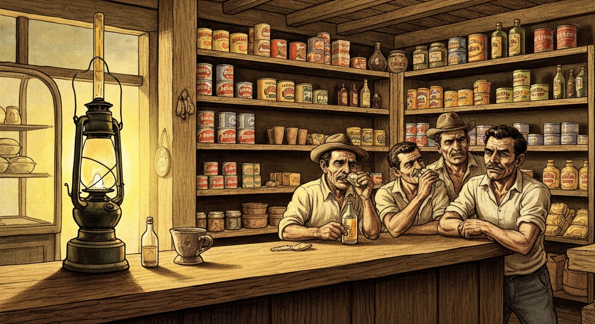
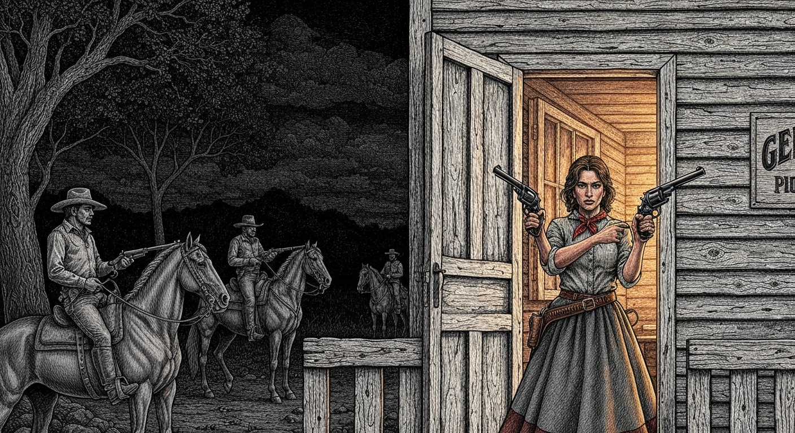

### O PRÊMIO DA VIDA

Por vales e campinas,  
Viagens além da colina.  
Doce infância campesina.  
Devaneios e sonhos de menino  
Brincando com seu cachorrinho.  
Que, sei lá... sumiu no caminho.  
Quanta saudade do pobrezinho.  

A vida segue em frente.  
Tudo muda de repente.  
O tempo cobra do vivente.  
Mesmo forte, enérgico e bravo  
O tempo bate em seu costado;  
Cobra pelos serviços prestados  
E certifica com comprido cajado.  

Não indaga como foi o começo;  
Das circunstâncias ou endereço.  
Se do lado direito ou do avesso.  
Apenas mede, pesa e põe preço.

---

## TEMPOS DE ANTANHO E DE AGORA

Gosto do meu tempo. No dia 8 de fevereiro de 1950, apenas um acontecimento de relevância: eu nasci. De resto, a história registra no mesmo dia o nascimento de Júlio Verne (1828) e de James Dean (1931). Um criou a ficção científica; o outro se tornou o ícone da juventude transviada. De alguma forma, ambos me instigaram na juventude.

Mas os romances deram lugar à realidade. Saímos da pedra lascada para a era digital — a mais curta, pacífica e transformadora das eras. Ter vivido este momento ímpar da história é um privilégio. Como disse Sêneca: *"O importante é viver, e viver bem"*. 

O homem foi à Lua, evoluiu do telefone discado para a internet, e constatou que a Terra é apenas um grão de areia azul. Não sabemos a origem de tudo, mas sabemos que temos a capacidade de raciocinar e de rir. Aprendemos a distinguir o bem do mal e que estamos aqui apenas de passagem. 

O mundo de antanho era igual ao de agora; diferente era o modo de vê-lo. Hoje, vivo a vida como na canção de Frank Sinatra: *"I did it my way"*. Planejei cada curso, vivi cada atalho e fiz tudo do meu jeito. E foi desse "meu jeito" que, um dia, apareceu na nossa frente o **caminhãozinho de mudança**.

---

## O CAMINHÃOZINHO DE MUDANÇA

Minhas recordações levam-me ao tempo da infância em [Barão de Cotegipe](/locais/barao-de-cotegipe/), Rio Grande do Sul. Dos sete irmãos, eu era o quarto. Brincávamos entre arvoredos e pedregulhos de pega-pega e esconde-esconde, recitando rimas que mal entendíamos: *"Guiri, guiri gaio... escampa sotto il gaio... alora fatte furbo!"*. Era o som das nossas raízes italianas ditando o ritmo da brincadeira.

Do topo da nossa colina, víamos ao longe, além do vale, uma vila que era o nosso mundo dos sonhos. Imaginávamos uma igreja grande, carroças e uma bodega cheia de caramelos. Um dia, na esperança de que nossos passos fossem mais longos, calçamos as botas grandes de papai. Queríamos atravessar o vale num instante, como se tivéssemos as botas de sete léguas do Pequeno Polegar — personagem que nem conhecíamos. Nossa única história era a do Negrinho do Pastoreio.

### O Navio de Noé sobre Rodas

Um dia, no começo do inverno, o anúncio: — *"Vamos mudar, vamos embora!"*. 

O que seria "ir embora"? No dia seguinte, a resposta apareceu na forma de um **Chevrolet 51**, o famoso "Boca de Sapo". Tudo foi carregado: camas, panelas, e os bichos organizados em andares. Por baixo de tudo, os porcos leitões; na traseira, num cercadinho, a vaca e o burro; e a carga subia mais alto que a própria vaca. 

Nós, os seis irmãos, fomos acomodados **todos embolados** em cima da carga, junto com papai e o tio Ângelo — ambos de chapéu de feltro de aba curta, firmes contra o vento. A piazada ia se descabelando, de olhos arregalados pra paisagem que não acabava mais. Ninguém cantava; estávamos impressionados demais com o mundo que se abria diante de nós.

Na cabine, o chofer levava mamãe com o maninho de dois anos no colo — e mais um na barriga. O gato ficou pra trás na lenda: foi pro mato, que o fogo queimou, que a água apagou... e por ali sumiu.

### A Travessia do Rio Uruguai

O primeiro grande desafio foi cruzar o **Rio Uruguai** numa balsa de madeira. O rio era largo, e todos ficamos em cima do caminhão durante a travessia, vendo as águas passarem devagar sob o peso da nossa vida inteira. A balsa era segura, mas pra um guri de sete anos, ver aquela imensidão de água era de tirar o fôlego.

No rio, avistamos **balsas de toras de madeira** descendo a correnteza. Disseram que aquela madeira ia para a Argentina e de lá cruzava o oceano de navio até a Europa. O mundo estava ali, passando diante dos nossos olhos, em forma de árvores gigantes flutuando rumo ao desconhecido.

### A Pousada em Xanxerê e o Assombro da Luz

Quando a noite caiu, chegamos em **Xanxerê**. Foi um assombro: casas com luzes que não eram velas nem lamparinas. Papai explicou que era a tal da **luz elétrica**. 

No hotel, o luxo era modesto mas impressionante pra quem vinha da roça: uma jarra com água, uma bacia para o asseio, e o conhecido **pinico esmaltado** debaixo da cama. Dormimos igual pedra. O cansaço de um dia inteiro levando sacolejo em cima da carga venceu qualquer novidade.

### Pato Branco e a Procissão dos Fogos

Partimos com o clarear do dia, atravessando descampados cobertos de geada. O frio era cortante, mas íamos enrolados nos acolchoados de penas de galinha. Em algum momento, o vento arrancou o chapéu da cabeça do tio Ângelo — e lá se foi, rodopiando pela estrada.

Era **29 de junho de 1957**, dia de São Pedro. Chegamos a **Pato Branco** em meio a uma procissão, com fogos de artifício que faziam os cachorros ganirem e o burro agitar as orelhas. Eu tinha sete anos e sentia o coração bater forte diante daquela multidão. Mas logo a cidade ficou para trás e o Chevrolet 51 se embrenhou na mata sombreada pelos pinheiros.

### O Rancho de Tábuas e o Mutirão

Por volta da meia tarde, chegamos ao destino final: um rancho de tábuas lascadas do tio Eurico, que mal coube a pouca mobília. Era o começo de tudo no Paraná.

Para limpar a capoeira e plantar, papai organizou um **mutirão**. Ver vinte peões com foices gritando *"Auia!"* e ouvindo o *"vapete-vapete"* do mato caindo era uma música rústica. O pagamento? Um **fandango** na semana seguinte: moças perfumadas, homens com brilhantina no cabelo, e o som da gaita e do pandeiro correndo a madrugada.

### A Bodega

Mas o meu mundo real, a universidade onde aprendi a ler a alma dos homens, ficava no armazém de Secos e Molhados do meu pai. Ali, o movimento era constante e de um colorido que nenhum livro escolar tinha. Pessoas vinham de todo lado: uns a pé, com o pó da estrada grudado na pele; outros a cavalo, suados pelo galope. Todos de chapéu de palha e facão pendurado na cintura — instrumento inseparável tanto na lida, quanto para impor respeito.

Eu, guri, observava tipos como o **Theodoro**, viciado no baralho, e o **Pedrinho Facão**, sempre alegre contando lorotas. Mas ninguém causou tanto bafafá quanto o **João Madalena**.

Ninguém sabia de sua origem. Por ali chegara, montado em um cavalo bem encilhado, com uma mulher e dois filhos, e se acomodou num rancho já abandonado pelo Velho Moisés, que regatava seu dinheirinho com empreitadas lascando tabuinhas de pinheiro para construção de casas.

João Madalena, seguidamente comparecia na bodega mais para tomar um trago do que para fazer alguma compra. Uma feita, já noitezinha, João Madalena solicitou ao papai que lhe entregasse um punhal que havia depositado na chegada, conforme o costume. Papai, sabendo que ele não havia depositado faca alguma, mesmo assim esforçou-se e procurou o dito punhal. Entreguei, não entregou — e a prosa azedou. João Madalena foi enrolando a açoiteira no cabo, em claro sinal que se preparava para um ataque. Papai se preveniu pondo a mão no peso da balança de um quilo e, quando João ergueu o braço, papai se afastou por puro instinto de defesa e arremessou o peso que pegou de raspão na testa do sujeito.

Foi aquele ba-fa-fá. Uns correram, outros acudiram o homem desmaiado, tido como morto. De pronto as portas foram fechadas e nós corremos para o sótão, tremendo de medo, ouvindo os murmúrios lá fora. O homem estava vivo — apenas com um pouco de sangue. Montaram em seus cavalos e sumiram na escuridão.

Não demorou e ouviu-se o tropel que parou em frente à bodega. Alguém gritou: — Abre a porta senão vamos arrombar na bala!

Nós em pânico, porém sem um choro — quase estáticos. Mamãe viu quando papai empunhou o revólver e foi para o lado da porta. Disse: — Eu abro, mas derrubo uns três, quatro. Papai era bom de tiro.

Num golpe de sorte e de coragem, mamãe tomou a arma da mão dele enquanto com a outra mão abria a porta. A porta foi se abrindo e ela calçou no revólver dizendo:

— **Atirem, seus covardes!**

Houve entre eles alguém de bom senso que pediu aos demais que não investissem: — É uma mulher!

Mesmo assim fizeram papai prisioneiro, sob a garantia e proteção de um de confiança. E lá se foram na escuridão, dizendo que iam para a delegacia.

Mamãe disse: — Essa tropa de bêbados não vai a delegacia alguma. Vão para seus ranchos — e de pronto. Montou num burro manso, e o guri mais velho num cavalo emprestado, e partiram noite adentro rumo à autoridade. Era meia-noite quando acordaram o delegado.

De pronto ele chamou sua escolta de não mais de cinco soldados e partiram. Na madrugada cercaram o rancho. Todos se entregaram sem resistência.

Ali era apenas uma subdelegacia, sendo que a mais próxima distava cinquenta quilômetros. O delegado chamou papai e mamãe num particular:

— O que faço com eles, que nem cadeia existe aqui? No mais, nem correu sangue — apenas ferimento leve. Vou ter que liberá-los.

Eles concordaram, porém antes desejavam explicar o causo aos meliantes. Mamãe se adiantou feito promotora e soltou os cachorros. Todos cabisbaixos e envergonhados pediram mil perdões. Em seguida, mais comedidamente, papai se pronunciou:

— Seu delegado, esses sujeitos devem receber alguma punição que sirva de exemplo para que não repitam mais esses atos.

O delegado declarou solenemente:

— Todos estão liberados, mas proibidos de frequentar bodega por 30 dias. Mais: voltem agora para suas casas, a pé e no sol quente.

E chamou um soldado: — Acompanhe esses indivíduos até fora da vila. E não me afronte mais, que o castigo será outro.

### Velório da Velha Sebastiana

As histórias não se davam só no balcão — seguiam pelas carreiradas e velórios até a beira da cova. Contavam na bodega que, no velório da **velha Sebastiana**, a paz durou pouco. Seus filhos, **Manezinho** e **Emiliano**, já não se bicavam. Emiliano, embriagado, provocou tanto que Manezinho perdeu o juízo. Pôs-se de pé e puxou do facão em pleno velório. Para não ser retalhado, o Emiliano valeu-se do sagrado: arrancou a cruz que guarnecia o caixão da própria mãe e usou-a como escudo, protegendo-se do facão que reluzia naquele lusco-fusco.

O povo se espantou, saindo porta a fora — e até pela janela. Aí vieram os mais corajosos e do "deixa disso", evitando assim o pior. O velório prosseguiu pela madrugada, sob o olhar atravessado dos irmãos por cima do corpo da falecida.

### O Rabo-de-Tatu

De outra feita, Emiliano provocou um cunhado chamando-o de ladrão de cano de fogão. O cunhado, que não era flor que se cheirasse, munido do **rabo-de-tatu**, desceu o mango que fez um estrago na paleta. Emiliano com o lombo ardido continuou:

— Ladrão, sem vergonha!

E lá se foi mais um laçaço, retrucando:

— Podem me chamar de ladrão, mas não de sem vergonha!

Mas logo tudo se acalmou e, como já era tardinha, todos se retiraram para suas casas — exceto Emiliano, que na tentativa de aliviar as dores pediu que lhe massageassem com cachaça. Fizeram. Mas aí o berro foi maior.

Nas arestas do tempo,  
Nas dobras do vento,  
Na memória distante,  
No agora, no instante;  
Vejo lutando ao relento  
Sem trégua e lamentos,  
Míticos sábios arcontes;  
Na busca do gene e da fonte.  

Nas longas jornadas ardentes,  
O mundo nunca foi diferente.  
Trilhas e caminhos estreitos,  
Mar, terra, rios e montes;  
Desertos, floras e fontes.  
Antes nada havia.  
Do nada, a luz.
